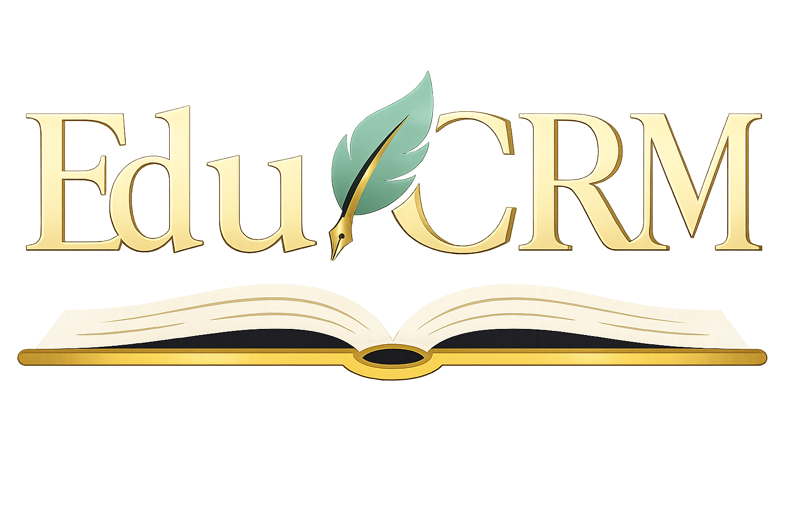

<p align="center">
  
</p>

<h1 align="center">Edu.CRM</h1>

<p align="center">
  <strong>Système de gestion scolaire interne</strong><br>
  <sub>Flask · SQLAlchemy · Tailwind CSS · Jinja2</sub>
</p>

<p align="center">
  <a href="https://github.com/daniel-sysnet/edu.crm">
    
  </a>
  
  
  
</p>

---

## 📋 Description

**Edu.CRM** est un CRM éducatif conçu pour la gestion centralisée des **étudiants**, **enseignants** et **cours** au sein d'un établissement scolaire. L'application offre un tableau de bord statistique, un système d'affectation cours/étudiants, et une interface moderne entièrement responsive.

---

## 👥 Équipe

| Membre | GitHub | Rôle |
|--------|--------|------|
| **Salim Taoufiq OUEDRAOGO** | [@BySalim](https://github.com/BySalim) | Lead Frontend · UI/UX · Intégration Tailwind · Logique model & UML |
| **Dauchez Daniel MOLOMBO AGOMA** | [@daniel-sysnet](https://github.com/daniel-sysnet) | Backend · Services métier · Logique CRUD |
| **Ahmadou Bamba Momar CISSE** | [@KINGABMC](https://github.com/KINGABMC) | Lead Backend · Architecture Flask · Base de données |
| **Christopher Macéan** | [@Macean-2001](https://github.com/Macean-2001) | Organisation · Sécurité · Organisation |
| **Baye Ndiawar Gueye** | [@ndiawargueye](https://github.com/ndiawargueye) | Backend · Services métier · Tests · Documentation |

---

## ✨ Fonctionnalités

| Module | Fonctionnalités | Contributeur(s) |
|--------|----------------|-----------------|
| **Authentification** | Login/logout sécurisé, sessions, décorateur `@login_required` | Macéan |
| **Dashboard** | Statistiques temps réel (totaux, cours populaire, étudiants sans cours, enseignants actifs) | Salim |
| **Étudiants** | CRUD complet, recherche, filtrage par genre, pagination, profil détaillé | Ndiawar, Bamba |
| **Enseignants** | CRUD complet, filtrage multi-critères (genre, spécialité), profil avec liste de cours | Daniel |
| **Cours** | CRUD, affectation/désaffectation d'étudiants, recherche d'enseignant par matricule | Bamba |
| **UI/UX** | Navbar pill, scrollbar custom, FAB global, flash toasts, skeleton loaders, footer équipe | Salim |

---

## 🛠 Technologies & Concepts

| Technologie | Pourquoi ? |
|-------------|-----------|
| **Flask 3.1** | Framework léger et modulaire — parfait pour apprendre l'architecture MVC en Python |
| **SQLAlchemy** | ORM puissant qui abstrait le SQL brut et facilite les relations (Many-to-Many, FK) |
| **Flask-Migrate** | Gestion des migrations de schéma DB sans perte de données |
| **WTForms** | Validation côté serveur des formulaires avec messages d'erreur intégrés |
| **Tailwind CSS (CDN)** | Styling utilitaire rapide — pas besoin de build pipeline, idéal pour le prototypage |
| **Jinja2 Macros** | Composants réutilisables (badges, avatars, tables) — évite la duplication de code HTML |
| **Blueprints Flask** | Séparation modulaire du code par domaine métier (auth, students, courses…) |
| **SQLite / PostgreSQL** | SQLite en dev pour la simplicité, PostgreSQL en prod pour la robustesse |
| **Material Symbols** | Bibliothèque d'icônes Google — cohérence visuelle sans assets locaux |
| **JavaScript vanilla** | Scrollbar custom, FAB |

---

## 📁 Structure du projet

```
edu.crm/
├── run.py                    # Point d'entrée
├── config.py                 # Configuration (Dev / Prod)
├── requirements.txt          # Dépendances Python
│
└── app/
    ├── __init__.py            # App factory
    ├── extensions.py          # SQLAlchemy & Migrate
    ├── cli.py                 # Commandes CLI (seed)
    ├── context_processors.py  # Variables globales templates
    │
    ├── models/                # Modèles de données
    │   ├── user.py            # Administrateur
    │   ├── student.py         # Étudiant (M2M → Course)
    │   ├── teacher.py         # Enseignant (1→N → Course)
    │   └── course.py          # Cours
    │
    ├── services/              # Logique métier
    │   ├── auth_service.py
    │   ├── student__service.py
    │   ├── teacher_service.py
    │   └── course__service.py
    │
    ├── auth/                  # Blueprint authentification
    ├── dashboard/             # Blueprint tableau de bord
    ├── students/              # Blueprint étudiants
    ├── teachers/              # Blueprint enseignants
    ├── courses/               # Blueprint cours
    │
    └── templates/
        ├── layouts/           # Layouts (app, auth, form)
        ├── macros/            # Composants réutilisables
        ├── partials/          # Navbar, footer, FAB, toasts
        └── [module]/          # Pages par module
```

---

## 🚀 Installation

### Prérequis

- Python 3.10+
- pip

### Étapes

```bash
# 1. Cloner le dépôt
git clone https://github.com/daniel-sysnet/edu.crm.git
cd edu.crm

# 2. Créer l'environnement virtuel
python -m venv .venv

# Windows
.venv\Scripts\activate
# Linux / macOS
source .venv/bin/activate

# 3. Installer les dépendances
pip install -r requirements.txt

# 4. Initialiser la base de données
flask db upgrade

# 5. (Optionnel) Peupler avec des données fictives
flask seed

# 6. Lancer l'application
python run.py
```

L'application sera accessible sur **http://127.0.0.1:5000**

### Connexion par défaut

| Email | Mot de passe |
|-------|-------------|
| `admin@educrm.sn` | `admin123` |

---

## 📈 Évolutions futures

Ce projet a vocation à évoluer. Dans le futur, nous envisageons de :

- **Déployer** l'application sur un serveur de production (Render, PythonAnywhere, etc.)
- **Améliorer** les fonctionnalités existantes (rapports détaillés, exports, notifications)
- **Ajouter** de nouvelles fonctionnalités (gestion des absences, notes, évaluations)
- **Optimiser** la performance et la sécurité
- **Étendre** les capacités d'intégration (APIs externes, webhooks)

Les contributions et suggestions d'amélioration sont bienvenues ! 🚀

---

## 🙏 Remerciements

Nous tenons à remercier chaleureusement **Mr Aly**, notre enseignant, pour nous avoir confié ce projet. Son encadrement et ses conseils nous ont permis de mettre en pratique les concepts du développement web dans un contexte concret et formateur. Ce projet a été une expérience d'apprentissage enrichissante pour toute l'équipe.

---

<p align="center">
  <sub>Fait avec ❤️ par l'équipe Edu.CRM — 2026</sub>
</p>
